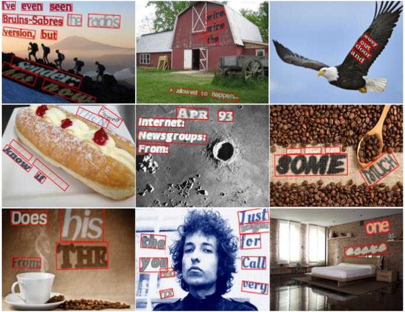

# SynthText
Code for generating synthetic text images as described in ["Synthetic Data for Text Localisation in Natural Images", Ankush Gupta, Andrea Vedaldi, Andrew Zisserman, CVPR 2016](http://www.robots.ox.ac.uk/~vgg/data/scenetext/).


**Synthetic Scene-Text Image Samples**


The code in the `master` branch is for Python2. Python3 is supported in the `python3` branch.

The main dependencies are:

```
pygame, opencv (cv2), PIL (Image), numpy, matplotlib, h5py, scipy
```

### Generating samples

```
python gen.py --viz
```

This will download a data file (~56M) to the `data` directory. This data file includes:

  - **dset.h5**: This is a sample h5 file which contains a set of 5 images along with their depth and segmentation information. Note, this is just given as an example; you are encouraged to add more images (along with their depth and segmentation information) to this database for your own use.
  - **data/fonts**: three sample fonts (add more fonts to this folder and then update `fonts/fontlist.txt` with their paths).
  - **data/newsgroup**: Text-source (from the News Group dataset). This can be subsituted with any text file. Look inside `text_utils.py` to see how the text inside this file is used by the renderer.
  - **data/models/colors_new.cp**: Color-model (foreground/background text color model), learnt from the IIIT-5K word dataset.
  - **data/models**: Other cPickle files (**char\_freq.cp**: frequency of each character in the text dataset; **font\_px2pt.cp**: conversion from pt to px for various fonts: If you add a new font, make sure that the corresponding model is present in this file, if not you can add it by adapting `invert_font_size.py`).

This script will generate random scene-text image samples and store them in an h5 file in `results/SynthText.h5`. If the `--viz` option is specified, the generated output will be visualized as the script is being run; omit the `--viz` option to turn-off the visualizations. If you want to visualize the results stored in  `results/SynthText.h5` later, run:

```
python visualize_results.py
```
### Pre-generated Dataset
A dataset with approximately 800000 synthetic scene-text images generated with this code can be found [here](http://www.robots.ox.ac.uk/~vgg/data/scenetext/).

### Adding New Images
Segmentation and depth-maps are required to use new images as background. Sample scripts for obtaining these are available [here](https://github.com/ankush-me/SynthText/tree/master/prep_scripts).

* `predict_depth.m` MATLAB script to regress a depth mask for a given RGB image; uses the network of [Liu etal.](https://bitbucket.org/fayao/dcnf-fcsp/) However, more recent works (e.g., [this](https://github.com/iro-cp/FCRN-DepthPrediction)) might give better results.
* `run_ucm.m` and `floodFill.py` for getting segmentation masks using [gPb-UCM](https://github.com/jponttuset/mcg).

For an explanation of the fields in `dset.h5` (e.g.: `seg`,`area`,`label`), please check this [comment](https://github.com/ankush-me/SynthText/issues/5#issuecomment-274490044).

### Pre-processed Background Images
The 8,000 background images used in the paper, along with their segmentation and depth masks, have been uploaded here:
`http://www.robots.ox.ac.uk/~vgg/data/scenetext/preproc/<filename>`, where, `<filename>` can be:

|    filenames    | size |                      description                     |             md5 hash             |
|:--------------- | ----:|:---------------------------------------------------- |:-------------------------------- |
| `imnames.cp`    | 180K | names of images which do not contain background text |                                  |
| `bg_img.tar.gz` | 8.9G | images (filter these using `imnames.cp`)             | 3eac26af5f731792c9d95838a23b5047 |
| `depth.h5`      |  15G | depth maps                                           | af97f6e6c9651af4efb7b1ff12a5dc1b |
| `seg.h5`        | 6.9G | segmentation maps                                    | 1605f6e629b2524a3902a5ea729e86b2 |

Note: due to large size, `depth.h5` is also available for download as 3-part split-files of 5G each.
These part files are named: `depth.h5-00, depth.h5-01, depth.h5-02`. Download using the path above, and put them together using `cat depth.h5-0* > depth.h5`.

[`use_preproc_bg.py`](https://github.com/ankush-me/SynthText/blob/master/use_preproc_bg.py) provides sample code for reading this data.

Note: I do not own the copyright to these images.

### Generating Samples with Text in non-Latin (English) Scripts
- @JarveeLee has modified the pipeline for generating samples with Chinese text [here](https://github.com/JarveeLee/SynthText_Chinese_version).
- @adavoudi has modified it for arabic/persian script, which flows from right-to-left [here](https://github.com/adavoudi/SynthText).
- @MichalBusta has adapted it for a number of languages (e.g. Bangla, Arabic, Chinese, Japanese, Korean) [here](https://github.com/MichalBusta/E2E-MLT).
- @gachiemchiep has adapted for Japanese [here](https://github.com/gachiemchiep/SynthText).
- @gungui98 has adapted for Vietnamese [here](https://github.com/gungui98/SynthText).
- @youngkyung has adapted for Korean [here](https://github.com/youngkyung/SynthText_kr).

### Further Information
Please refer to the paper for more information, or contact me (email address in the paper).
